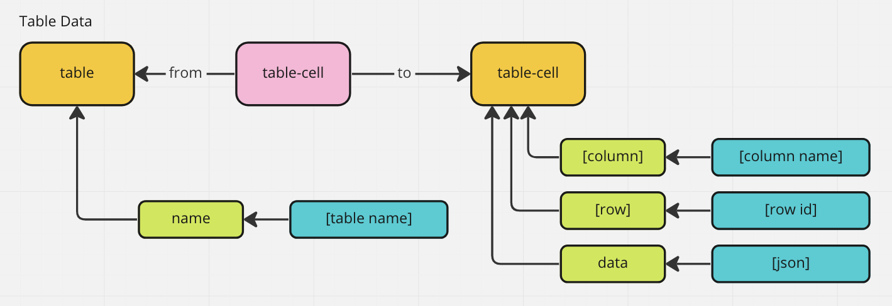
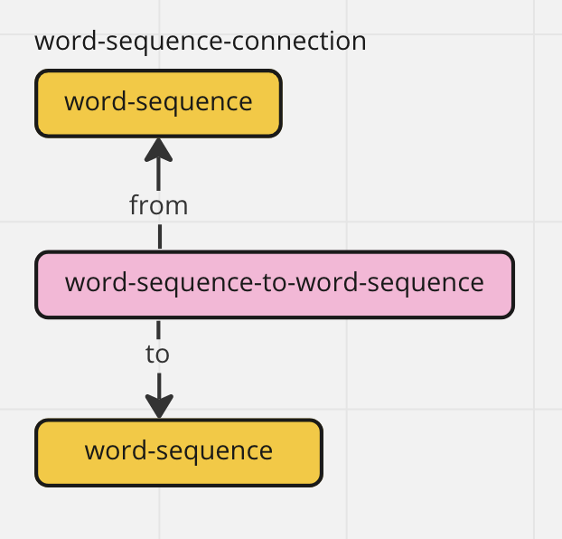

# Graph Schema

## Introduction

The graph schema is designed specifically to fit the needs of a crowd-sourcing application. It can be used to persist any kind of data structure, while allow the structure to be mutated in any way by any one. Any form of the structure can be recovered for any use case.

For example, you could have a document that you want everyone to be able to edit in any way they see fit. You also want to be able to view the document using only the edits of certain users during a certain timeframe. You'd also like to let users vote on different edits to the document, while showing the document using the most voted on edits, while also giving the option to show the edits from the votes of a specific group of users.

## Tables

Database [schema](https://github.com/etenlab/database-api/blob/main/src/core/sql/schema/v1.schema.sql)

- `node_types`
- `nodes`
- `node_property_keys`
- `node_property_values`
- `relationship_types`
- `relationships`
- `relationship_property_keys`
- `relationship_property_values`

### Legend for Illustrations


- Nodes are represented by orange boxes and are the root unit of how we store information in the graph.
- Every node has a type name stored as a string.
- Relationships (rel) connect two nodes.
- Every rel has a type name stored as a string.
- Both nodes and relationships can have properties.
- Properties are split into keys and values.
- Property keys point to a node or rel.
- Property values point to a property key.
- The decoupling of property keys and values allows us to expose options to users so that they can vote on whether a key is appropriate or not on a node/rel, as well as voting on what the value should be for each property key. This is one important way in which we enable crowd-sourcing.

## Layer 1 API: Low Level Operations using the Graph Repositories

### Node Type

- createNodeType(type_name: string): string
- listNodeTypes(): String[]
- listAllNodesByType(type_name: string): Node[]

### Nodes

- listAllNodesByType(type_name: string): Node[]
- createNode(type_name: string): uuid
- createNodePropertyKey(node_id: uuid, key_name: string): uuid
- createNodePropertyValue(key_id: uuid, key_value: any): uuid
- readNode(node_id: uuid) Node

### Relationship Type

- createRelationshipType(type_name: string): uuid
- listRelationshipsTypes(): String[]
- listAllRelationshipsByType(type_name: string): Relationships[]

### Relationships

- createRelationship(node_1: uuid, node_2: uuid, type_name: string): uuid
- createRelationshipPropertyKey(rel_id: uuid, key_name: string): uuid
- createRelationshipPropertyValue(key_id: uuid, property_value: any): uuid
- readRelationship(rel_id: uuid): Relationship
- listRelatedNodes(node_id: uuid): Array\<\{relationship: [Relationship Object], node: [Node Object]\}\>

### Elections

- createElection():uuid
- addBallotEntry(election_id: uuid, node_id: uuid): uuid
- addVote(ballot_entry_id: uuid, vote: boolean): uuid
- addVote(ballot_entry_id: uuid): boolean
- readElection(election_id: uuid): Election

### Discussion

- createDiscussion(): uuid
- createPost(discussion_id: uuid, content: string): uuid
- updatePost(post_id: uuid): boolean
- deletePost(post_id: uuid): boolean
- readDiscussion(discussion_id: uuid): Discussion

## Layer 2 API: Convenience Wrappers and Voting

### Node/Relationship CREATE

These functions will always create a new node or relationship. The root keys of the object will be used as the unique keys of the new node/relationship. The values of those keys will be the child value/object of the root keys passed in.

- createNodeFromObject(type_name: string, obj: {}): Node
- createRelationshipFromObject(type_name: string, obj: {}, from_node: uuid, to_node: uuid): Relationship
- createRelatedToNodeFromObject(node_uuid: uuid, rel_type_name: string, type_name: string, obj: {}): \{relationship: [Relationship Object], node: [Node Object]\}
- createRelatedFromNodeFromObject(type_name: string, obj: {}, rel_type_name: string, node_uuid: uuid): \{relationship: [Relationship Object], node: [Node Object]\}

### Node/Relationship UPSERT

These operations use a previously created node/relationship and are idempotent with key creation. They will first search for a key before inserting.

- upsertNodeObject(node_uuid: uuid, obj: {}): Node
- upsertRelationshipObject(rel_uuid: uuid, obj: {}): Relationship

### Voting


#### Elections

- createElection(node: uuid): uuid
  - creates a new election on a node
  - `node`: the uuid of the node to attach the election to.
  - returns the uuid of the `election` node that was created.
- listElections(id: uuid): uuid[]
  - lists all the elections on a given `node`
  - `id`: uuid of any node/relationship/key/value
  - returns an array of election uuids
- getElectionFull(election_id: uuid): ElectionFull
  - `election_id`: uuid of the election node to fetch
  - returns all the `ballot_entry`s with their votes on a given election

#### Ballot Entries

- addBallotEntry(election_id: uuid, ballot_entry_target: uuid): uuid
  - creates a new voting option on an election
  - `election_id`: uuid of election node to attach the new ballot entry to
  - `ballot_entry_target`: uuid of the node/relationship/key/value to create a ballot entry on
  - returns the uuid of the new `ballot_entry` node created.

#### Votes

- addVote(ballot_entry_id: uuid, vote: boolean?): uuid
  - adds a vote from the logged in user on a ballot entry. Votes are stored in their own table, not in the graph.
  - `ballot_entry_id`: uuid of the `ballot_entry` node that is being voted on
  - `vote`: nullable boolean of the vote. If `null`, the vote is removed from the `ballot_entry`
  - returns the uuid of the row in the votes table

## Layer 3 API: Feature Utility Functions

### Table Data



#### Table

- createTable(name: string): uuid
  - creates a table node and adds the name property
  - `name`: the name of the new table
  - returns the uuid of the table node
- getTable(name: string): uuid
  - `name`: the name of the table to search for
  - returns the uuid of the found table node or `null`

#### Column

- createColumn(table: uuid, column_name: string): uuid
  - create a new column node if the given name does not exist.
  - `table`: the table node uuid to add a column to
  - `column_name`: the name of the new column
  - returns the uuid of the new column node or the node that is found with the same name
- getColumn(table: uuid, column_name: string): uuid
  - `table`: uuid of the table node
  - `column_name`: name of the column to search for
  - returns the column uuid of the given name if there is one, `null` if not.

#### Row

- createRow(table: uuid): uuid
  - creates a new row node for the given table
  - `table`: uuid of the table node
  - returns the uuid of the new row node. This is used to create `table-cell`s
- getRow(table: uuid, finder: (table: uuid) => uuid): uuid
  - finds the row node using an given lambda to crawl the table's graph
  - `table`: uuid of the table node
  - `finder`: lambda that takes the table node uuid as input and crawls the table's graph to find the row node requestd.
  - returns the uuid of the found row node or `null`.

#### Cell

- createCell(column: uuid, row: uuid, value: {}): uuid
  - creates a new cell given the row and column nodes of a table
  - `column`: uuid of the column node
  - `row`: uuid of the row node
  - `value`: object to store as the new cell's value
  - returns the property-value's uuid
- readCell(column: uuid, row: uuid): {} | null
  - get a cell's value
  - `column`: uuid of a column node
  - `row`: uuid of a row node
  - returns the value of the data key of the cell node for a given row and column, `null` if not found.
- updateCell(column: uuid, row: uuid, value: {}): uuid
  - `column`: uuid of a column node
  - `row`: uuid of a row node
  - `value`: ojbect to store in the cell
  - return the property-value's uuid if the cell is found and updated, `null` if not found or updated.

### Key Terms


### Document


- createDocument(name: string): uuid
  - `name`: the name of the document you want to create
  - returns the uuid of the `document` node
- getDocument(name: string): uuid
  - `name`: the name of the doucment you want to find
  - returns the uuid of the `document` node if there is one, `null` if not found.

### Word


- createWord(word: string, language: uuid): uuid
  - creates a word in the given language if it does not already exist.
  - `word`: the word. There shouldn't be any spaces. In the current system we define words by splitting on white space.
  - `language`: the uuid of the `table-row` of the language this word is in. `word`s shall only be in one language.
  - Returns the uuid of the word created. If a word already exists, it will return the uuid of the previously created word.
- getWord(word: string, language: uuid): uuid
  - `word`: the word you want to find.
  - `language`: uuid of the `table-row` for the language you want to search in.
  - Returns the uuid of the `word` node. `null` if no word is found.

### Word Translation


- createWordTranslationRelationship(from: uuid, to: uuid): uuid
  - connects two words from different languages using the translation relationship if one does not already exists.
  - `from`: uuid of word node
  - `to`: uuid of word node. shall be in a different language than `from` node.
  - returns the uuid of the relationship node created or found.

### Word Sequence


- createWordSequence(text: string, document: uuid, creator: uuid, import-uid: string, language: uuid): uuid
  - creates a new word sequence in the given language for a specific document.
  - `text`: the word sequence to store in the graph. The function will split it using whitespace and not punctuation. Tokens created from the string will be used to create the word nodes
  - `document`: the documnet node uuid that the new `word-sequence` node will be associated to.
  - `creator`: the `user` node uuid that the new `word-sequence` node will be associated to. This is not the owner of the text (if any), this is the user account who imported/created it in the system.
  - `import-uid`: this is a free field for the importer/creator to use to distinguish different imports or versions. This will can be used later in read queries to show different import runs.
  - `language`: uuid of `table-row` node of the language this `word-sequence` is. `word-sequence`s shall only be one language. To construct sentences of multiple languages just point from one sequence to the next.
  - Returns the node uuid from the `word-sequence` node created.
  - This function will always create a new `word-sequence`.

### Word Sequence Connection



- appendWordSequence(from: uuid, to: uuid): uuid
  - `from`: uuid of the `word-sequence` node that should be first in the sequence.
  - `to`: uuid of the `word-sequence` node that should come second in the sequence.
  - Returns the uuid of the relationship node that is created.
  - This is how we will store documents in our system. Documents are series of `word-sequence` nodes.
- getWordSequence(text: string): uuid[]
  - `text` string of words to find in the database
  - Returns an array of `word-sequence` node uuids if there are any that match the `text` given. `null` if no uuids where found.

### Word Sequence Translation


- createWordSequenceTranslationRelationship(from: uuid, to: uuid): uuid
  - connects two word sequences from different languages using the translation relationship if one does not already exist.
  - `from`: uuid of source word sequence node
  - `to`: uuid of target word sequence node. shall be in a differnt language than source
  - returns the uuid of the relationship node that is created.

### Dictionary


Uses following DefinitionService methods:

- `createWord(word: string, langId: Nanoid): Promise<Nanoid>` 
  - creates word. Uses from `Word`:
  - `graphThirdLayerService.createWord(word: string, language: uuid): uuid`

- `createDefinition(definitionText: string,forNodeId: Nanoid): Promise<Nanoid>`
  - creates a definition if it does not already exist for this node (check on full definition sting comparsion).
  - `definition`: the definition value. Arbitrary string.
  - `forNodeId`: the uuid of node for which this definition is written.
  - Returns the uuid of the definition created. If a definition already exists for given node, it will return the uuid of the previously created definition.

- `getDefinitionsAsVotableContent(nodeId: string): Promise<Array<VotableContent>>`
- finds definitions related to given nodeId, add votes and returns as VotableContent
  ```
  export type VotableContent = {
    content: string;
    upVote: number;
    downVote: number;
    id: Nanoid | null;
  };
  ```

- `getWordsAsVotableItems(langNodeId: string,): Promise<Array<VotableItem>>`
- finds words for given language `langNodeId`, add votes and definitions as VotableContent 
- returns VotableItem array
```
export type VotableItem = {
  title: VotableContent;
  contents: VotableContent[];
};
```


### Phrase Book


Uses following DefinitionService methods:

- `createDefinition` (look at  [Dictionary](#dictionary))
- `getDefinitionsAsVotableContent` (look at  [Dictionary](#dictionary))

- `createPhrase(phrase: string, langId: Nanoid): Promise<Nanoid>` 
  - creates Phrase if it does not already exist (check on full definition sting comparsion).
  - `phrase` - phrase value, arbitrary string.
  - `langId` - Id of the language node, in which this phrase is written.
  - Returns the uuid of the phrase created. If a phrase already exists, it will return the uuid of the previously created phrase.

- `getPhrasesAsVotableItems(langNodeId: string,): Promise<Array<VotableItem>>`
  - finds phrases for given language `langNodeId`, add votes and definitions as VotableContent 
  - returns VotableItem array
```
export type VotableItem = {
  title: VotableContent;
  contents: VotableContent[];
};
```

- `getPhrase(phrase: string, language: uuid): uuid`
  - `phrase`: the phrase you want to find.
  - `language`: uuid of the `table-row` for the language you want to search in.
  - Returns the uuid of the `phrase` node. `null` if no phrase is found.
