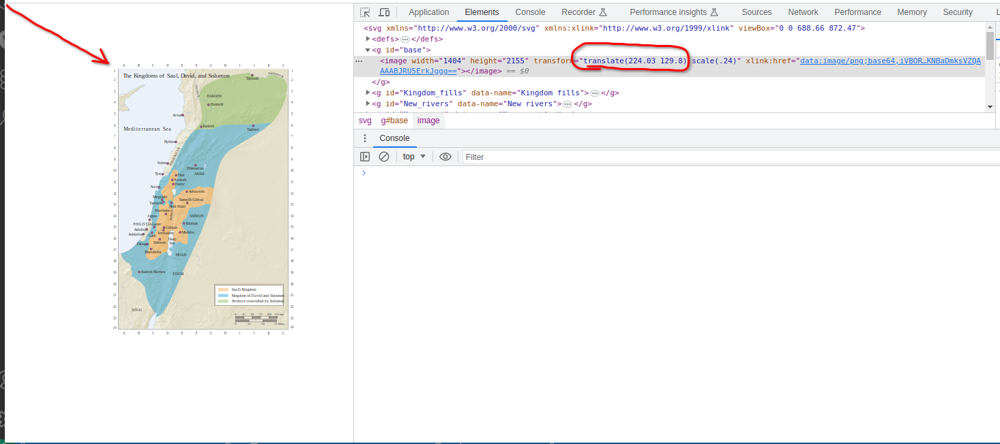

# Map parsing & translations.
Crowd.Bible has functionality to upload, parse & translate maps or other .SVG images that have text content. 
The algorithm that parses these image files expects that text to be parsed is placed inside tags.


### A brief description of the parsing algorithm

1. Words are read from the so called 'texty' tags. For now, 'texty' tags are the highest found 
`<text>` or `<textPath>` tags. Everythnig enclosed inside one texty tag considered by the system as one single word.

Note: no matter if there are any children tags - all insides will be flatten and children tag values will be concatenated into one string. I.e. look at the example:
```xml
  <g id="Labels">
    <text class="cls-34" transform="translate(280.75 220.48)">
      <tspan class="cls-25" x="0" y="0">R</tspan>
      <tspan x="3.25" y="0">ome</tspan>
    </text>
    <text class="cls-34" transform="translate(408.85 281.43)">
      <tspan class="cls-17" x="0" y="0">A</tspan>
      <text class="cls-57" x="3.61" y="0">th ens</text>
    </text>
  </g>
```
We have here 2 'texty' tags `<text>` and some other tags `<tspan>` and `<text>` inside each of them. So, after the parsing we will have 2 words: 'Rome' and 'Ath ens'. 

Note that 'Ath ens' considered as a single word despite space.

Note that only highest tag `<text>` considered as 'texty', the inner `<text>` tag, as well as all other `<tspan>` tags will be flattened, and the resulted parsed map will have only top level 'texty' tag, all it's internals will be substituted by concatenated value:
```xml
  <g id="Labels">
    <text class="cls-34" transform="translate(280.75 220.48)">
      Rome
    </text>
    <text class="cls-34" transform="translate(408.85 281.43)">
      Ath ens
    </text>
  </g>
```

2. If 'texty' tag has result value as single letter or number, this tag is ignored for translation. (i.e. there no word/translation will be created in the system)

3. Tags 'rect', 'style', 'clipPath', 'image' and all internals of these tags are completely ignored.


### Here some advices about .svg structure for better parsing:
1. Do not allow words to have unintentional spaces. I.e. for desirable word 'Athens':

NOT OK:
```xml
    <text class="cls-34" transform="translate(408.85 281.43)">
      <tspan class="cls-17" x="0" y="0">A</tspan>
      <text class="cls-57" x="3.61" y="0">th ens</text>
    </text>
```
OK:
```xml
    <text class="cls-34" transform="translate(408.85 281.43)">
      <tspan class="cls-17" x="0" y="0">A</tspan>
      <text class="cls-57" x="3.61" y="0">thens</text>
    </text>
```

2. Each word must be enclosed into its own 'texty' tag. No parts of other words should be there.

NOT OK:
```xml
    <text class="cls-34" transform="translate(280.75 220.48)">
      <tspan class="cls-25" x="0" y="0">R</tspan>
      <tspan x="3.25" y="0">ome</tspan>
      <tspan class="cls-17" x="0" y="0">A</tspan>
      <text class="cls-57" x="3.61" y="0">thens</text>
    </text>
```
OK:
```xml
    <text class="cls-34" transform="translate(280.75 220.48)">
      <tspan class="cls-25" x="0" y="0">R</tspan>
      <tspan x="3.25" y="0">ome</tspan>
    </text>
    <text class="cls-34" transform="translate(408.85 281.43)">
      <tspan class="cls-17" x="0" y="0">A</tspan>
      <text class="cls-57" x="3.61" y="0">thens</text>
    </text>
```

3. Single letters and numbers neither considered by the system as words, nor translated. In fact they are ignored. So if you know that some letter or number is part of a word, it is better to include it to the relevant texty tag.

4. As mentioned before, all internals of the texty tag are substituted by its concatenanted values. So don't rely on it's position coordinates.

OK:
```xml
    <text class="cls-34" transform="translate(280.75 220.48)">
      <tspan>A</tspan>
      <tspan>thens</tspan>
    </text>
```

ALSO OK BUT WILL HAVE THE SAME RESULT AFTER PARSING:
```xml
    <text class="cls-34" transform="translate(280.75 220.48)">
      <tspan x="323" y="343">A</tspan>
      <tspan x="361" y="333">thens</tspan>
    </text>
```

5. Coordinates of the existing maps and all maps internals are shifted realatively to the upper left corder of the viewport:

It leads to empty spaces and wrong scale of the map when it is placed to a page.
To make possible proper positioning of a map, it should have coordinates starting from (0,0) without any additional shift.